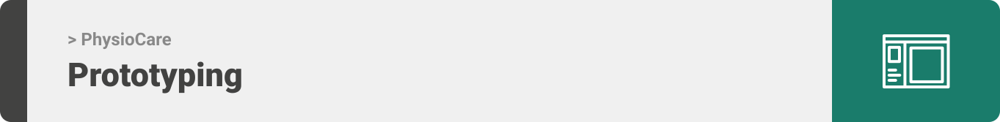

<div align="center">

> PhysioCare provides a mobile application that makes the connection of users (patients and
> physiotherapists) much easier.
> **[PROJECT PHILOSOPHY](https://github.com/mhmdkayyali/physio-care#-project-philosophy) • [WIREFRAMES](https://github.com/mhmdkayyali/well_app#-wireframes) • [TECH STACK](https://github.com/mhmdkayyali/physio-care#-tech-stack) • [IMPLEMENTATION](https://github.com/mhmdkayyali/physio-care#-impplementation) • [HOW TO RUN?](https://github.com/mhmdkayyali/physio-care#-how-to-run)**

</div>

<br><br>


> The PhysioCare app is a medical and health care app built based on the observed needs of the community. The PhysioCare app makes connecting patients to Physical therapists a breeze.

### User Stories

- #### Physiotherapist Stories
  - As a physiotherapist, I want to see my patients on map, so that I can estimate how far are they from me
  - As a physiotherapist, I want to see my patients in a list, so that I can find them quickly
  - As a physiotherapist, I want to see my appointments in a list, so that I can know my schedule
  - As a physiotherapist, I want to have and edit it my profile, so that patients can know my information
  - As a physiotherapist, I want to see my patients profile, so that I can know their information
  - As a physiotherapist, I want to be able to cancel my appointments, so that I can reschedule
- #### Patient Stories

  - As a patient, I want to see all physiotherapists on map, so that I can estimate how far are they from me
  - As a patient, I want to see all physiotherapists in a list, so that I can find them quickly
  - As a patient, I want to see my appointments in a list, so that I can know my schedule
  - As a patient, I want to have and edit it my profile, so that physiotherapists can know my information
  - As a patient, I want to see physiotherapist's profile, so that I can know their information
  - As a patient, I want to be able to book an appointment, so that I can see a physiotherapist
  - As a patient, I want to be able to cancel my appointments, so that I can reschedule them

  <br><br>



> This design was planned before on paper, then moved to Figma app for the fine details.
> Note that i didn't use any styling library or theme, all from scratch and using pure css modules

| Login                                                                                                 | Sign up (select user type)                                                                                  | Sign up (location)                                                                                                                      | Sign up (Therapist availability)                                                                                 |
| ----------------------------------------------------------------------------------------------------- | ----------------------------------------------------------------------------------------------------------- | --------------------------------------------------------------------------------------------------------------------------------------- | ---------------------------------------------------------------------------------------------------------------- |
|  |  |  |  |

| Home                                                                                               | List view of therapists                                                                                  | Therapist details                                                                                                          | Drawer                                                                                                  |
| -------------------------------------------------------------------------------------------------- | -------------------------------------------------------------------------------------------------------- | -------------------------------------------------------------------------------------------------------------------------- | ------------------------------------------------------------------------------------------------------- |
|  |  |  |  |

| Schedule a day                                                                                                   | Schedule a time                                                                                                   | Appointments                                                                                                 | Cancel appointment                                                                                                               |
| ---------------------------------------------------------------------------------------------------------------- | ----------------------------------------------------------------------------------------------------------------- | ------------------------------------------------------------------------------------------------------------ | -------------------------------------------------------------------------------------------------------------------------------- |
|  |  |  |  |

<br><br>


Here's a brief high-level overview of the tech stack the Well app uses:

- This project uses the [react-native](https://reactnative.dev/) framework. It is a JavaScript framework for writing real, natively rendering mobile applications for iOS and Android.
- For maps implementation, the project uses [react-native-maps](https://www.npmjs.com/package/react-native-maps?activeTab=readme) for the map view.
- It uses [prisma](https://www.prisma.io/). A next-generation object–relational mapper (ORM). It is used to connect to the database. It is used to generate the database schema and the client. It uses a custom Schema Definition Language (SDL) that automatically writes migrations and generates type-safe code.
- This project also uses [MySQL](https://www.mysql.com/). A relational database management system (RDBMS) based on SQL – Structured Query Language. It is used to store the data.

<br><br>


> Using the above mentioned tech stacks and the wireframes build with figma from the user sotries we have, the implementation of the app is shown as below, these are screenshots from the real app

| Login - first Sign up screen                                                                                        | Patient Home (Can see all therapists)                                                                                   | Therapist Home (Can see patients who booked sessions)                                                                       | List View                                                                                                     |
| ------------------------------------------------------------------------------------------------------------------- | ----------------------------------------------------------------------------------------------------------------------- | --------------------------------------------------------------------------------------------------------------------------- | ------------------------------------------------------------------------------------------------------------- |
|  |  |  |  |

| Drawer                                                                                                  | Edit Profile                                                                                                        | Patient Details                                                                                                           | Videocall                                                                                                     |
| ------------------------------------------------------------------------------------------------------- | ------------------------------------------------------------------------------------------------------------------- | ------------------------------------------------------------------------------------------------------------------------- | ------------------------------------------------------------------------------------------------------------- |
|  |  |  |  |

| Book Appointment                                                                                                            | Cancel Appointment                                                                                                              | Signup Map      | Therapist Availability      |
| --------------------------------------------------------------------------------------------------------------------------- | ------------------------------------------------------------------------------------------------------------------------------- | --------------- | --------------------------- |
|  |  |  |  |

<br><br>


> This is an example of how you may give instructions on setting up your project locally.
> To get a local copy up and running follow these simple example steps.
> This is an example of how to list things you need to use the software and how to install them.

### Prerequisites

- npm
  ```sh
  npm install npm@latest -g
  ```
- Expo Go app on your phone

### Installation

1. Clone the repo

   ```sh
   git clone https://github.com/mhmdkayyali/physio-care.git
   ```

2. Install [Node.js](https://nodejs.org/en/)
3. Go to physiocare_server directory
   ```sh
   cd physiocare_server
   ```
4. Install npm packages
   ```sh
   npm install
   ```
5. Run the server

   ```sh
   nodemon .
   ```

6. Go to physiocare_frontend directory

   ```sh
   cd physiocare_frontend
   ```

7. Install npm packages
   ```sh
   npm install
   ```
8. Run physiocare_frontend
   ```sh
   expo start
   ```
9. Scan QR that appeared in the terminal with your phone (expo go app required)
